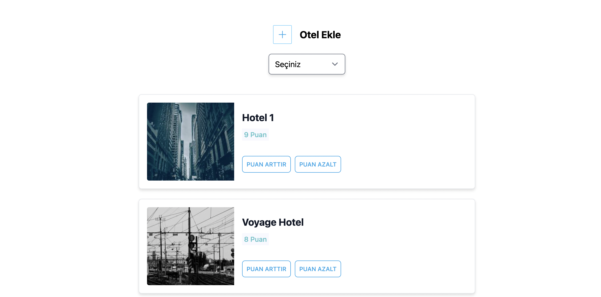
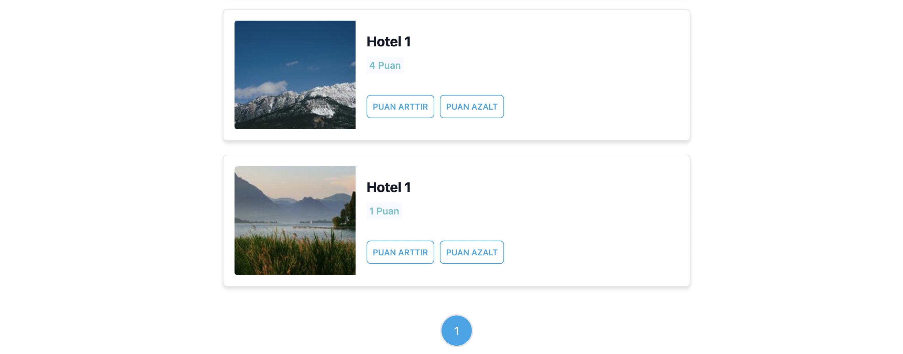
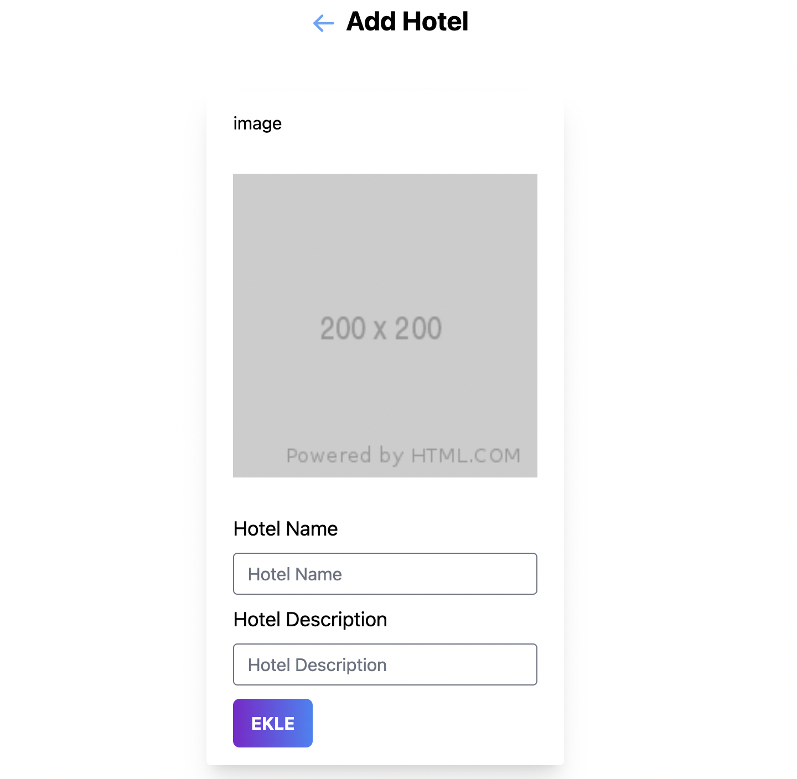
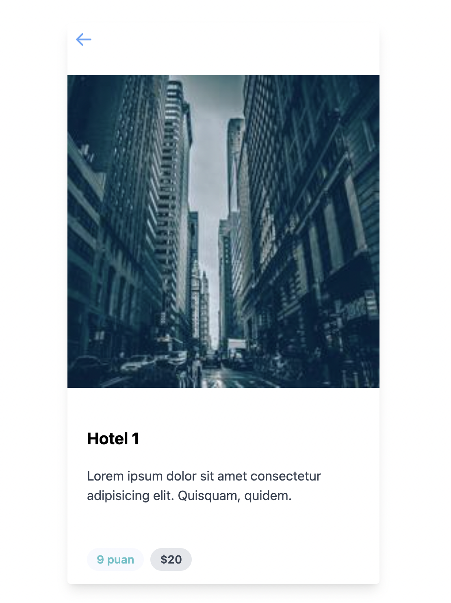
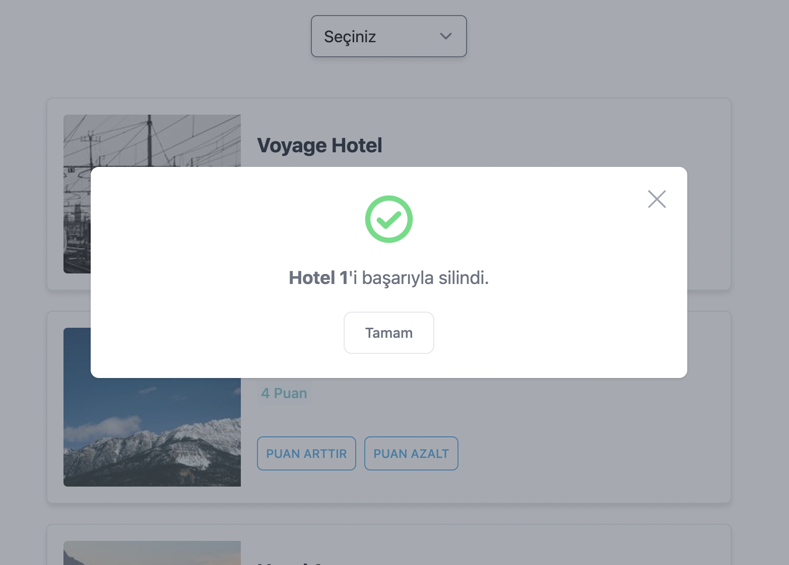
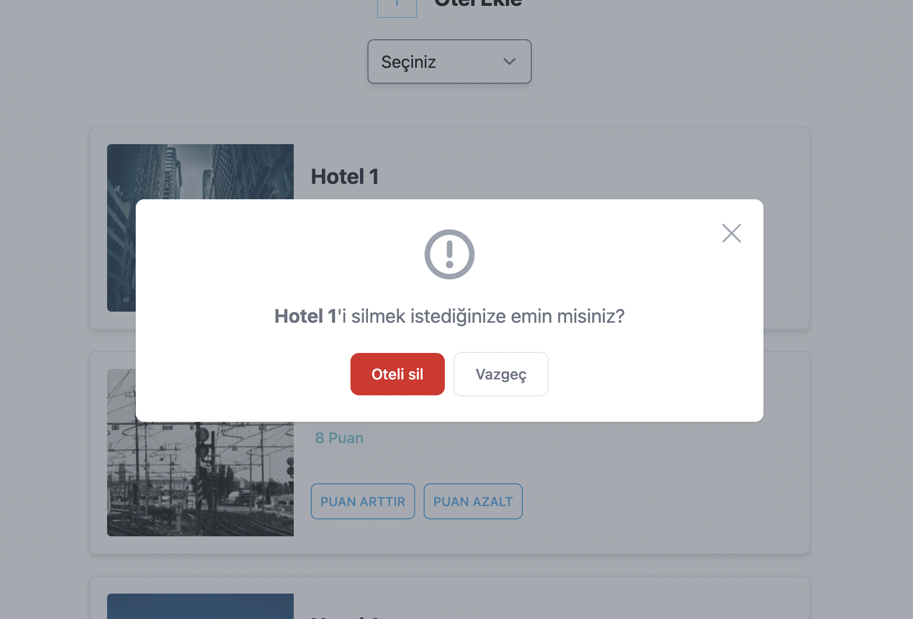

# hotel Booking App

Hotel Booking app

## Tech Stack

- [pnpm](https://pnpm.io/tr/)
- [tailwindcss](https://tailwindcss.com/)
- [React](https://tr.reactjs.org/)
- classnames
- prettier
- lodash
- nanoid
- phosphor-react
- typescript

## Screenshots









## Get Started

Install my-project with npm

```bash
    git clone https://github.com/denizyoldas/hotel-app.git

    cd hotel-app

    pnpm Install

    pnpm start
```

## Authors

- [@denizyoldas](https://www.github.com/denizyoldas)
